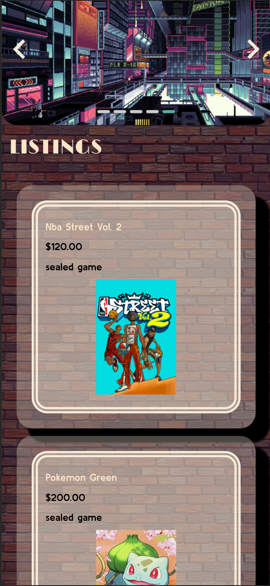

# AnyYes

## Description 📰

AnyYes is a Customer-to-Customer (C2C) retro-gaming e-commerce application. Although the primary motivator to make this app was to put our knowledge of front and back-end software development to work, this specific idea originated from collaborator Sal, who pointed out that there isn't an e-commerce app in the retro-gaming sector, so we decided to make one dedicated to that niche, also building on the C2C aspect of it, allowing users of the site to both buy AND sell retro games and consoles. This solves the problem for the retro-gaming demographic/audience; whereas they once did not have a dedicated or streamlined channel to buy these products, AnyYes provides them that opportunity.  
In building this application, we learned many things, notably: how to implement Stripe to process payments, how to implement multer to allow users to upload photos of their products, more knowledge on Bulma CSS, and a new CSS framework to utilize image carousels via Splidejs. Beyond just these libraries, we also got to put into real practice, the solid foundation and flow to connect back and front-end together utilizing Sequelize and Handlebars.

## Table of Contents

&nbsp;&nbsp;&nbsp;&nbsp;&nbsp;&nbsp; ➣ [Installation](#Installation)

&nbsp;&nbsp;&nbsp;&nbsp;&nbsp;&nbsp; ➣ [Usage](#Usage)

&nbsp;&nbsp;&nbsp;&nbsp;&nbsp;&nbsp; ➣ [Contributing](#Contributing)

&nbsp;&nbsp;&nbsp;&nbsp;&nbsp;&nbsp; ➣ [Deployed-Link](#Deployed-Link)

&nbsp;&nbsp;&nbsp;&nbsp;&nbsp;&nbsp; ➣ [Questions](#Questions)

## Installation 🔌

In order to install, please run `npm i`.

## Usage 🧮

In order to use this app, please run `npm start`.
If you would like to pre-seed the application with sample content, please run `npm run seed`.

Upon landing on the homepage of AnyYes, the user will be presented with the navigation bar with options to view all listings available for games and consoles, as well as the option to log in, along with an aesthetically-pleasing image-carousel of video-game pixel art.  

Demonstrating our site's responsiveness, in mobile view, upon scrolling down a bit, the user will see the three latest listings that were created by users, as well as all the other listings that came before.  

The user can also search for any listings via a keyword:  

Upon viewing any single listing, the user can see key details about the product and can add the item to their cart.  

However, to assume full capabilities of the site, like actually viewing one's cart and making purchases or listings, all one has to do is sign up or log in, done via our login modal.  

From log in, the user will be redirected to their profile page, where they are greeted personally, can see any listings they made and any orders for any purchases they've made, as well as the option to create a listing to sell something of theirs!

## Contributing 🍴

In order to contribute, one must fork their repository and create a pull request.

## Deployed Link 📲
[AnyYes](https://anyyes-3bf9b8d1cf29.herokuapp.com/)

## Questions 📭

Please enjoy my work at my GitHub, @[mintyry](https://github.com/mintyry).
